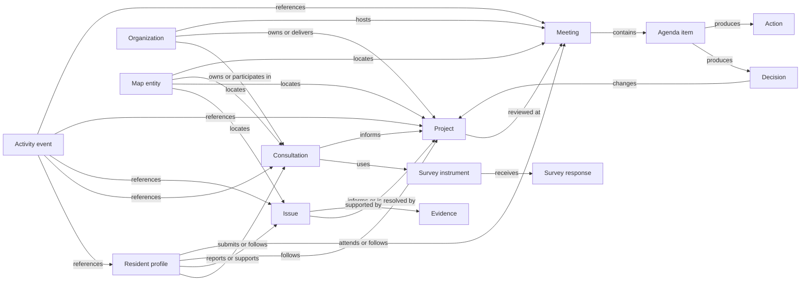

# Downtown Perks Resident Governance Platform

## Product Requirements Document and Implementation Foundation

Version: 2.0

Status: canonical pre-implementation specification

Revision: experience-complete civic intelligence contract

Audience: product, design, content, engineering, data, security, board operations, and QA

## 1. Product objective

Governance is the resident-facing civic layer of Downtown Perks. It connects community questions, issues, consultations, projects, meetings, evidence, partners, decisions, and outcomes through one shared object model.

Residents should feel that they are helping improve Downtown Austin. They should not feel that they are navigating a government portal or completing disconnected forms.

Every governance surface must answer, in order:

1. What is happening?
2. Why does it matter to me or my neighborhood?
3. What can I do next?
4. What will happen after I act?
5. How can I see the outcome?

## 2. Non-negotiable product rules

### 2.1 One object, many views

An issue, project, consultation, meeting, question, document, organization, location, or resident exists once. The map, Governance Home, resident history, partner workspace, board workspace, reports, and AI surfaces reference the same object ID.

Do not create separate map, survey, meeting, or workspace copies of the same civic object.

### 2.2 Neutral participation

DANA and other civic organizations may collect, moderate, group, and publish issue-focused questions. They must not use the product to endorse or oppose political candidates.

Candidate-question experiences must always show:

> DANA does not endorse political candidates. We collect, organize, and communicate resident perspectives on issues affecting Downtown Austin.

### 2.3 Resident privacy

Resident-level contributions may be stored with consent and used for the resident's own history and recommendations. Public and partner views show aggregated or expressly public information only.

Default partner access must never expose:

- a resident's complete activity history;
- household or building membership unless operationally required;
- demographic attributes;
- private survey answers;
- private evidence or attachments;
- personal contact information;
- AI conversation history.

### 2.4 AI augments; people decide

AI may summarize, classify, suggest, cluster, retrieve, and draft. It may not publish, moderate finally, assign an accountable owner, change an official status, approve a question, cast a vote, or represent a board decision without a human action and audit record.

### 2.5 Map first, not map only

Every location-relevant civic object can appear on the map. The map is a view of the shared object, not a second content system. Non-geographic objects remain discoverable without forcing a pin.

### 2.6 A consultation is living civic work

Do not reduce a consultation to a survey and an export. It is a connected public process:

```text
Campaign
-> consultation
-> progressive questions
-> map and evidence
-> discussion
-> reviewed analysis
-> board view
-> resident report
-> accountable actions
-> partner collaboration
-> published outcome
```

The survey is one way to contribute. The map, discussion, meeting record, project timeline, resident report, and outcome remain available as views of the same work.

## 3. Resident navigation

### 3.1 Route-level resident destinations

The resident product supports seven first-class destinations:

| Destination | Purpose | Canonical route |
| --- | --- | --- |
| Home | Personal starting point and next actions | `/resident/home` |
| Map | Place and civic discovery | `/map?mode=resident` |
| Perks | Eligible offers and resident value | `/map?mode=resident&tab=perks` |
| Events | Nearby events and meetings | `/map?mode=resident&tab=events` |
| Governance | Civic participation and progress | `/residents/governance` |
| Card | Resident pass and eligibility | `/resident/home?panel=card` |
| Profile | Preferences, notifications, privacy, and history | `/resident/profile` |

### 3.2 Mobile navigation contract

The persistent mobile dock contains five items to preserve native touch geometry:

```text
Home | Map | Perks | Events | Governance
```

Card and Profile remain one-tap actions in the Home header and Governance account menu. They are route-level destinations but do not compete for dock space.

Governance may open as a full resident route or as a map-connected bottom sheet. Both render the same canonical data and preserve back, close, browser history, query state, and map camera state.

### 3.3 Desktop and tablet

Desktop and tablet navigation may expose all seven destinations. Navigation labels, routes, and analytics IDs must remain identical across viewports.

## 4. Governance information architecture

```text
Governance
├── Overview
├── Consultations
├── Projects
├── Issues map
├── Meetings
├── Accessibility
├── Community priorities
├── Questions
├── Reports
├── Transparency
├── Following
└── My contributions
```

Surveys are instruments inside consultations, not an isolated product. Saved content and history are resident views of followed or contributed governance objects, not duplicate repositories.

## 5. Complete resident journeys

### 5.1 Open Governance and understand what matters now

Entry points:

- mobile resident navigation;
- Resident Home;
- civic map layer;
- notification;
- shared project, issue, consultation, or meeting link;
- Ask the Map response.

Journey:

1. Governance opens with a personalized but privacy-safe greeting.
2. The resident sees the most relevant current action, not a module menu.
3. Community pulse explains current priorities with a source and update time.
4. Nearby consultations, projects, issues, and meetings use the resident's selected area or consented location.
5. The resident can participate, follow, open the map, or close Governance.
6. Opening Governance writes one `governance_viewed` event.

Success: the resident can explain what needs attention and what they can do within five seconds.

### 5.2 Join a consultation

1. Resident opens a consultation from Home, Governance, the map, a notification, or a project.
2. Overview states the decision being informed, responsible organization, participation window, privacy treatment, and expected next update.
3. Resident reviews the timeline, location, documents, partners, discussion, and related objects.
4. Resident chooses `Share your perspective`.
5. Before the first question, the resident sees a realistic time estimate, current step, total steps, and visible progress. A typical compact flow may read `About 5 minutes · Step 2 of 6`.
6. The consultation asks one relevant question at a time using progressive steps.
7. A selected priority reveals a tailored branch; unrelated branches remain hidden. For example, choosing Accessibility can ask whether the resident personally encountered a barrier, then offer a location picker, evidence upload, and short description. Transportation questions must not appear merely because they exist in the same instrument.
8. Resident may attach a location or evidence when relevant.
9. An optional conversational step can ask concise follow-up questions such as where, when, frequency, and who is affected. Suggested categories remain editable and are never silently applied.
10. Review step shows exactly what will be submitted and whether the contribution is public, anonymous, or private.
11. Submission creates one contribution and one immutable submission event.
12. Confirmation explains what happens next and offers Follow or View related work.

The system must preserve a draft locally and server-side for authenticated residents. Anonymous participation, when allowed, uses a separate consent and recovery model.

### 5.3 Report or support an issue

1. Resident selects `Report an issue` or long-presses the civic map.
2. Resident chooses or confirms a location.
3. Resident describes what is happening in plain language.
4. Deterministic search and optional AI classification suggest a category and possible matches.
5. Similar issues show distance, status, last update, and why they may match.
6. Resident chooses `Support this issue` or `Create a new report`.
7. New reports accept optional photos, video, documents, or voice notes with explicit public/private controls.
8. Review shows location, category, evidence visibility, and contact permissions.
9. Submission creates or links to one canonical issue.
10. Resident sees the issue timeline and can follow updates.

Duplicate detection must never silently merge submissions. The resident chooses, and moderators can later merge with an auditable relationship.

### 5.4 Follow a project

1. Resident opens a project from Governance, the map, a meeting, an issue, or a partner update.
2. Project explains why it exists, current status, responsible organization, location, timeline, recent milestone, next milestone, related issues, and resident participation opportunities.
3. Resident selects `Follow project`.
4. Notification preferences are confirmed without forcing marketing consent.
5. Project appears in Following and My contributions.
6. Milestones and status changes notify the resident according to preference.
7. Completed projects publish outcomes, evidence, and unresolved follow-up.

### 5.5 Participate in a meeting

1. Resident opens an upcoming or past meeting.
2. Upcoming meeting shows date, access details, agenda, documents, related objects, accessibility information, and registration.
3. Resident can follow, register, submit a question, or add the meeting to their calendar.
4. Live state shows the approved public stream and agenda progress when available.
5. Past meeting shows recording, transcript, approved summary, decisions, actions, votes, documents, and related objects.
6. AI-generated material remains labeled `Draft` until board review and publication.
7. Resident can trace a decision from meeting to project, issue, consultation, and outcome.

### 5.6 Build or support a civic question

1. Resident opens the active question call.
2. Neutrality statement appears before the form.
3. Resident starts with the question in their own words. The product may suggest clear issue categories such as Transportation, Construction, Downtown access, Business impact, or Accessibility.
4. Resident reviews and may change every suggested category before continuing.
5. Similar public questions are shown with their topic, supporter count, status, and a plain-language explanation of why they may match.
6. Resident may support an existing question or submit a distinct one. The product must never pressure a resident to accept a suggested duplicate.
7. Submission status begins as `received`.
8. Board moderation may clarify wording but must retain the original text and an edit history.
9. Approved questions can be sent to the event organizer.
10. Publication records whether the question was submitted, asked, answered, or not selected.
11. Resident receives the outcome if notifications were requested.

No candidate endorsement, ranking, donation, campaign coordination, or vote-intent feature is permitted.

### 5.7 Add evidence

1. Resident selects `Add evidence` from an issue, project, consultation, or map location.
2. The product explains accepted formats and visibility.
3. Resident uploads media or records a note.
4. Resident confirms location, captured time, description, and whether identifying metadata should be removed.
5. Automated safety checks may flag content but cannot publish it automatically.
6. Evidence remains `under review` until accepted or made private.
7. Accepted evidence links to the canonical object and appears only at its approved visibility level.

### 5.8 Ask a governance question

1. Resident asks a natural-language question from Governance or Ask the Map.
2. Context builder receives only authorized resident preferences, current route, bounded map context, and public governance objects.
3. Retrieval finds approved records and current civic sources.
4. Response answers the question, explains its sources, distinguishes official records from community reports, and offers executable next actions.
5. Resident may open the source object, follow it, view it on the map, or refine the question.
6. The question and response write privacy-scoped interaction events; the model does not retain platform memory.

### 5.9 Manage My Governance

1. Resident opens My contributions.
2. Sections show consultations completed, issues reported or supported, questions submitted, projects followed, meetings followed, and volunteer activity.
3. Each row shows current status and latest meaningful update.
4. Resident may change notification preferences, withdraw optional public attribution, or request permitted data actions.
5. Historical official records remain intact; privacy actions affect resident attribution according to policy rather than deleting public decisions.

## 6. Governance Home screen contract

### 6.1 Content order

1. Compact header with back/close, Governance identity, and resident account access
2. Personalized hero and one recommended next action
3. Community pulse with source and update time
4. Current consultations
5. Civic map preview
6. Active projects
7. Board activity
8. Upcoming meetings
9. My contributions
10. Published reports and recent outcomes
11. Ways to get involved

### 6.2 Hero copy model

```text
Good evening, Sarah.
Help shape Downtown.
2 consultations open · 1 project followed · 4 new updates
[Continue participating]
```

Counts must be real. When unavailable, use a meaningful next action instead of zero-filled metrics.

### 6.3 Community pulse

Community pulse represents aggregated, threshold-protected contribution signals. It is not a scientific opinion poll unless the underlying method satisfies that claim.

Each pulse item must show:

- topic;
- direction of change;
- plain-language explanation;
- response window;
- participation count or `Not enough responses yet`;
- methodology link;
- last updated time.

Never show false precision. A percentage must have a defined numerator, denominator, time window, and minimum cohort threshold.

### 6.4 Five connected resident experiences

Governance must feel like one resident product expressed through five connected experiences:

1. **Share your perspective** — progressive, adaptive questions with saved progress and a clear review step.
2. **Show where it is happening** — an optional map location, category, evidence, nearby-match check, and non-map alternative.
3. **Tell the story** — a short resident-led conversation that asks only useful follow-up questions and returns editable suggestions.
4. **See your contributions** — completed consultations, supported questions, followed work, responses, and next updates in one resident history.
5. **Follow what changed** — a public timeline from participation through review, recommendation, implementation, completion, and any unresolved follow-up.

These are not separate products. They use the same contribution, object, relationship, and event records.

## 7. Screen and UI state matrix

Every route, sheet, drawer, card, rail, form, and action must implement the applicable states below.

| State | Required behavior | Required resident copy pattern | Forbidden behavior |
| --- | --- | --- | --- |
| Loading | Preserve page geometry; announce progress; allow close/back | `Loading current projects…` | Full-page spinner without context |
| Empty | Explain why empty and offer one useful action | `No consultations are open right now. Follow Governance for the next one.` | Blank cards or zeros |
| Partial data | Show verified fields and mark missing context | `Timeline awaiting confirmation` | Inventing dates, owners, or status |
| Success | Confirm action and what happens next | `Your response was received. DANA will publish a summary after review.` | Generic `Success` |
| Validation error | Identify the field and preserve answers | `Choose up to three priorities.` | Clearing the form |
| Network error | Preserve draft and offer retry | `Your draft is safe on this device. Try submitting again.` | Losing evidence or answers |
| Permission denied | Explain access without exposing protected data | `This document is available to board members.` | Revealing object existence beyond permission |
| Closed | Keep approved record readable; disable participation | `This consultation closed July 28. Read the outcome.` | Hiding history |
| Archived | Explain why archived and link successor when present | `This project is archived. Current work continues in…` | Presenting as active |
| Completed | Lead with outcome and evidence | `Completed · Safer crossing installed` | Ending at `Closed` without result |
| Under review | Explain reviewer and next update | `DANA is reviewing responses. Next update due August 4.` | Indefinite status |
| Moderated | Preserve edit history and reason | `Combined with a similar issue` | Silent merge or deletion |
| Offline | Read cached public content; queue allowed drafts | `You're offline. Your draft will remain on this device.` | Claiming submission completed |
| Realtime update | Announce meaningful change without losing scroll | `Project status changed to In progress.` | Forced refresh |
| AI unavailable | Continue deterministic search and forms | `Search is limited right now. You can still browse current work.` | Blocking Governance |
| AI draft | Label, source, and require review | `Draft summary · awaiting board review` | Publishing as official record |

### 7.1 Consultation states

`draft -> scheduled -> open -> reviewing -> outcome_published -> archived`

Canceled consultations use `canceled` with a required reason and retained public record when already announced.

### 7.2 Issue states

`received -> triaged -> under_review -> assigned -> planned -> in_progress -> resolved -> verified -> archived`

Additional non-terminal states: `needs_information`, `duplicate_candidate`, `blocked`.

### 7.3 Project states

`proposed -> discovery -> consultation -> approved -> planned -> in_progress -> completed -> monitoring -> archived`

### 7.4 Meeting states

`draft -> scheduled -> agenda_published -> live -> processing -> review -> record_published -> archived`

## 8. Reusable component inventory

No governance-only visual language may be introduced. Components use the existing Editorial, Directory, and Glass surface system.

| Component | Surface | Decision it supports | Reuse |
| --- | --- | --- | --- |
| `GovernanceHeader` | Glass | Leave, return, or open account | All Governance routes and sheets |
| `GovernanceHero` | Editorial | Understand what matters now | Governance Home, organization landing pages |
| `NextCivicAction` | Editorial | Choose the single best next step | Home, consultation confirmation, project updates |
| `CommunityPulse` | Editorial | Understand priority movement | Home, reports, organization workspace |
| `ConsultationRow` | Directory | Decide whether to participate | Home, consultations, related content |
| `ProjectRow` | Directory | Decide whether to follow or inspect | Home, projects, issue relationships |
| `IssueRow` | Directory | Support, open, or compare an issue | Search, duplicate detection, project context |
| `MeetingRow` | Directory | Register, follow, or read the record | Home, meetings, related objects |
| `CivicMapPreview` | Glass | Open location-based context | Home, consultation, project, issue |
| `ObjectStatusLine` | Editorial | Understand current state and next update | Every governance object |
| `ObjectRelationshipRail` | Directory | Move between related canonical objects | Every detail view |
| `ParticipationStepper` | Editorial | Complete a consultation progressively | Consultation and survey flows |
| `AdaptiveQuestion` | Editorial | Answer one relevant question | Consultation steps |
| `LocationPicker` | Glass | Confirm where something is happening | Issue, evidence, consultation |
| `DuplicateIssueChoice` | Directory | Support existing or create distinct report | Issue creation |
| `EvidenceUploader` | Editorial | Add and classify supporting evidence | Issue, project, consultation |
| `ContributionReview` | Editorial | Confirm content, consent, and visibility | Every submission flow |
| `OutcomeSummary` | Editorial | See what changed and why | Completed consultation/project/issue |
| `OfficialRecordNotice` | Editorial | Distinguish official, draft, and community content | Meetings, reports, AI summaries |
| `NeutralityNotice` | Editorial | Understand candidate-question boundaries | Candidate questions |
| `SourceList` | Directory | Verify facts and update times | AI responses, reports, community pulse |
| `GovernanceAssistant` | Glass | Ask and act on grounded governance context | Governance, Map, board workspace |
| `NotificationPreferences` | Editorial | Choose meaningful updates | Follow and profile flows |
| `EmptyStateAction` | Editorial | Recover from an empty state | All collections |

Component APIs must accept canonical IDs and typed view models. They must not fetch unrelated datasets or contain workflow decisions.

## 9. Universal object relationship model

### 9.1 Canonical object types

```text
Organization
Workspace
ResidentProfile
MapEntity
Issue
Project
Consultation
SurveyInstrument
SurveyResponse
Question
Discussion
Comment
Evidence
Meeting
AgendaItem
Decision
Vote
Action
Document
Campaign
Event
Notification
ActivityEvent
Report
```

### 9.2 Relationship principles

- Relationships are explicit records with source, creator, visibility, and timestamps.
- Many-to-many links use relationship records, never arrays of copied objects.
- A map pin references an object's canonical ID and coordinates; it does not become a new object.
- A survey instrument belongs to a consultation or research program; responses belong to the instrument and permitted resident identity.
- A meeting references agenda items; decisions and actions reference the agenda item that produced them.
- Evidence references one primary object and may be related to others through explicit links.
- Merged issues keep both original IDs and a `merged_into` relationship.
- Public summaries are derived artifacts linked to source records, not replacements for them.

### 9.3 Relationship diagram



### 9.4 Visibility classes

| Class | Examples | Default access |
| --- | --- | --- |
| Public official | published agendas, minutes, decisions, outcomes | Everyone |
| Public community | approved issue summary, anonymous public comment | Everyone |
| Resident private | drafts, saved objects, notification preferences | Resident and authorized operations |
| Moderation | unreviewed submissions, flags, internal notes | Authorized moderators |
| Board restricted | draft minutes, legal review, confidential attachments | Authorized board roles |
| Partner aggregate | thresholded engagement and demand signals | Authorized organization roles |
| System audit | permission changes, publication actions, AI runs | Authorized audit roles |

## 10. AI interaction model and boundaries

### 10.1 Shared pipeline

```text
Authorized object context
-> deterministic filters
-> semantic retrieval
-> bounded context assembly
-> OpenAI Responses API
-> structured result validation
-> application grounding
-> human review when official
-> activity and audit events
```

The LLM is stateless. Downtown Perks owns memory, permissions, sources, and the official record.

### 10.2 Agent responsibilities

| Agent | May do | May not do |
| --- | --- | --- |
| Resident Assistant | Explain published records, find nearby work, suggest participation | Reveal restricted data or submit without confirmation |
| Governance Agent | Summarize approved activity and link sources | Declare an official position |
| Survey Agent | Suggest branches and draft questions | Publish an instrument or change answers |
| Insights Agent | Cluster thresholded contributions and identify themes | Expose individual histories or claim causation without evidence |
| Accessibility Agent | Identify reported hotspots and suggest review priorities | Declare ADA compliance or final priority |
| Meeting Agent | Draft summaries, actions, and communications from supplied records | Publish minutes, assign final owners, or alter votes |
| Communications Agent | Draft public copy from approved facts | Send or publish without approval |

### 10.3 Required AI states

- `unavailable`: deterministic product continues.
- `drafting`: output is not official.
- `needs_review`: accountable reviewer named.
- `approved`: human-approved output linked to source version.
- `rejected`: retained in audit history, not public.
- `superseded`: newer approved output exists.

### 10.4 Grounding requirements

Every resident-facing factual answer must provide:

- object IDs used;
- human-readable sources;
- source update times;
- distinction between official records, partner updates, and community reports;
- uncertainty when records conflict or are incomplete;
- executable actions restricted to allowed UI actions.

AI cannot directly publish, delete, charge, message, change permissions, change official status, or cast a vote.

## 11. Civic map integration rules

### 11.1 Governance layer

The map adds a `Governance` layer with filterable object kinds:

```text
Issues
Projects
Consultations
Meetings
Accessibility
Construction
Volunteer events
Neighborhood improvements
```

### 11.2 Pin identity

- One location-relevant object produces at most one active map representation.
- Related surveys, questions, evidence, updates, and campaigns attach to the canonical object drawer.
- Route stops reference canonical pins; they never create duplicate pins.
- Multiple objects at the same location use a grouped location result, not overlapping duplicate coordinates.
- Non-geographic meetings, reports, and consultations do not receive fabricated coordinates.

### 11.3 Pin and status treatment

- Pins use the existing navy, gold, and white map language.
- Category is communicated by glyph and accessible label, not color alone.
- Resolved or completed objects remain discoverable through history filters but do not visually compete with active work.
- Community-reported and official objects must be visually and textually distinguishable.

### 11.4 Drawer order

```text
Navigation and close
Object identity and official/community status
Why it matters
Current state and next update
Primary resident action
Map/location context
Timeline
Evidence or documents
Discussion summary
Responsible organizations
Related canonical objects
Sources
```

Every drawer stays within the visible viewport, scrolls internally, preserves the map, and supports back and close.

### 11.5 Map action allowlist

Resident AI and UI may execute only:

- open object;
- apply governance filter;
- move to verified coordinates;
- follow or unfollow after confirmation;
- begin issue report;
- begin consultation;
- open source;
- search again.

## 12. Notification and lifecycle event model

### 12.1 Notification principles

- Following an object is distinct from marketing consent.
- Nearby alerts require location permission or a resident-selected area.
- Residents control channel, frequency, quiet hours, and topic.
- Sensitive moderation and board-only state changes never appear in resident notifications.
- Every notification links to the canonical object and records delivery state.

### 12.2 Resident notification events

| Trigger | Default notification | Suppression rule |
| --- | --- | --- |
| Consultation opened | Followed topic or nearby area | No broad blast without consent |
| Consultation closing | 48-hour reminder for started or followed consultation | Do not remind after completion |
| Response received | Immediate in-product confirmation | Always available in history |
| Issue acknowledged | Status and responsible organization | Suppress internal assignment notes |
| Issue changed state | Plain-language progress update | Only meaningful state changes |
| Project milestone | What changed and what is next | Followed projects only |
| Meeting agenda published | Date, topics, access | Followed governance or related objects |
| Meeting record published | Decisions, actions, sources | Never publish AI draft |
| Board response published | Link response to contribution | Only contributing or following residents |
| Outcome published | What changed because of participation | Participants and followers |
| Nearby urgent civic notice | Verified source, area, expiry | Requires area/location preference |

### 12.3 Canonical activity events

Events are immutable facts, not mutable object state. Minimum fields:

```text
event_id
event_type
occurred_at
actor_type
actor_id or anonymous_session_id
object_type
object_id
organization_id
workspace_id
map_entity_id
source_surface
session_id
visibility
consent_basis
properties
schema_version
correlation_id
causation_id
```

### 12.4 Event taxonomy

```text
governance_viewed
consultation_viewed
consultation_started
consultation_step_completed
consultation_submitted
consultation_followed
issue_search_performed
issue_duplicate_suggested
issue_supported
issue_submitted
issue_status_changed
evidence_added
evidence_reviewed
project_viewed
project_followed
project_status_changed
meeting_viewed
meeting_registered
meeting_question_submitted
meeting_record_published
candidate_question_submitted
candidate_question_moderated
candidate_question_sent
candidate_question_answered
discussion_comment_submitted
notification_sent
notification_opened
governance_question_asked
governance_answer_returned
ai_draft_created
ai_draft_approved
ai_draft_rejected
```

Analytics, recommendations, reports, and automation consume this stream. They must not create separate tracking schemas for the same action.

## 13. Organization and workspace model

DANA, Downtown Austin Alliance, Waterloo Greenway, and future civic partners share the same governance engine.

Each organization workspace receives role-scoped views of:

- owned and participating projects;
- consultations;
- issues assigned or shared;
- meetings;
- actions;
- documents;
- public communications;
- thresholded engagement reporting;
- approved AI drafting tools.

Organizations do not receive duplicate copies of shared objects. Ownership, participation, responsibility, and visibility are relationship roles.

### 13.1 DANA workspace

DANA needs board, committee, meeting, project, resident-question, issue, consultation, report, transparency, document, budget, and communication views. The first screen should lead with decisions due, resident input awaiting review, actions without an owner, and records ready to publish—not a module directory.

### 13.2 Downtown Austin Alliance workspace

Downtown Austin Alliance needs initiative and construction updates, public-realm projects, activations, resident questions, shared issues, documents, milestones, partner comments, and thresholded participation reporting. A waterfront or streetscape project must remain the same canonical project when DANA, DAA, and residents view it.

### 13.3 Waterloo Greenway workspace

Waterloo Greenway needs trail and park improvements, environmental stewardship, volunteer work, tree projects, construction updates, events, consultations, partnership responsibilities, and measured outcomes. Event attendance and volunteer activity may relate to a project but must not be copied into a second project record.

### 13.4 Workspace decision contract

Every organization workspace must answer:

1. What needs attention now?
2. What did residents say?
3. What evidence supports it?
4. Who is responsible for the next action?
5. What can be published now?
6. What will residents see next?

AI-produced themes, summaries, questions, minutes, newsletters, website copy, and social copy remain drafts until an authorized person approves them.

## 14. Accessibility and inclusive participation

- WCAG 2.2 AA is the minimum release target.
- All actions have 44px targets and visible keyboard focus.
- Forms support screen readers, error summaries, saved progress, and plain-language instructions.
- Map-based participation always has a non-map alternative.
- Evidence does not require a photo.
- Meetings disclose physical, remote, language, and mobility access information.
- Color never carries status alone.
- Reduced motion is supported.
- Resident contributions may be anonymous when policy permits.
- Participation must not require attendance at a meeting.

## 15. Measurement framework

Primary outcomes:

- resident participation rate;
- consultation completion rate;
- issue acknowledgment and resolution time;
- board response time;
- percentage of active projects with a current public status;
- meeting record publication time;
- return participation rate;
- percentage of outcomes linked to resident input;
- community trust trend measured with a documented method.

Guardrails:

- contribution abandonment by step;
- moderation reversal rate;
- notification opt-out and complaint rate;
- AI draft rejection and correction rate;
- unresolved accessibility reports;
- privacy requests and incidents;
- cohort sizes below reporting threshold;
- objects without a responsible organization or next update date.

## 16. Release sequence after foundation approval

### Phase 1 — Public foundation

- Governance route and navigation
- Governance Home with verified seed content
- published meetings, projects, consultations, and transparency records
- map Governance layer for verified objects
- follow and notification preferences

### Phase 2 — Resident participation

- progressive consultations
- questions
- issue reporting and duplicate choice
- evidence
- My contributions

### Phase 3 — Board operations

- meeting and agenda workflow
- moderation
- decisions and actions
- project and consultation publishing
- audit and reporting

### Phase 4 — Civic partner workspaces

- organization roles and shared-object relationships
- assignments and public updates
- thresholded analytics

### Phase 5 — Governed AI

- bounded retrieval and sources
- draft meeting summaries
- issue classification assistance
- thresholded theme analysis
- resident questions and recommendations
- review, approval, and audit workflows

No phase may create a parallel user, event, map, survey, project, issue, or organization model.

## 17. Definition of foundation complete

The platform may proceed to schema and API design only when:

- every primary resident journey has an entry, action, confirmation, and outcome path;
- every screen has loading, empty, error, closed, archived, and completed behavior where applicable;
- component ownership and reuse are agreed;
- object relationships and visibility classes are approved;
- AI allowlists, forbidden actions, sources, and review gates are approved;
- map identity and duplicate rules are approved;
- notification triggers and event taxonomy are approved;
- mobile navigation reconciliation is approved;
- political-neutrality copy is approved by DANA;
- privacy, retention, accessibility, and moderation policies have accountable owners;
- no unresolved requirement would force a second canonical data model.
